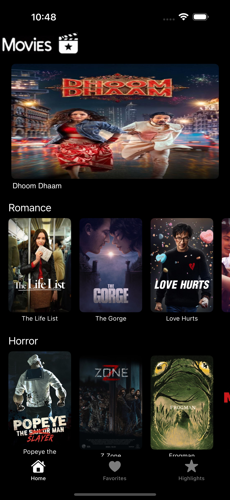
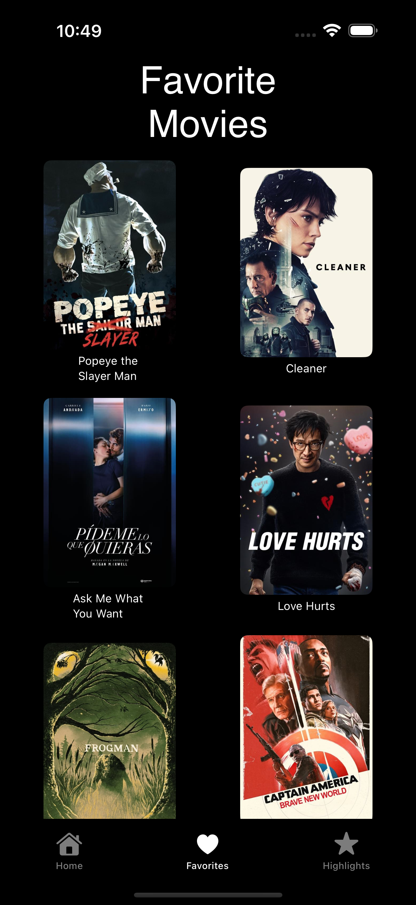
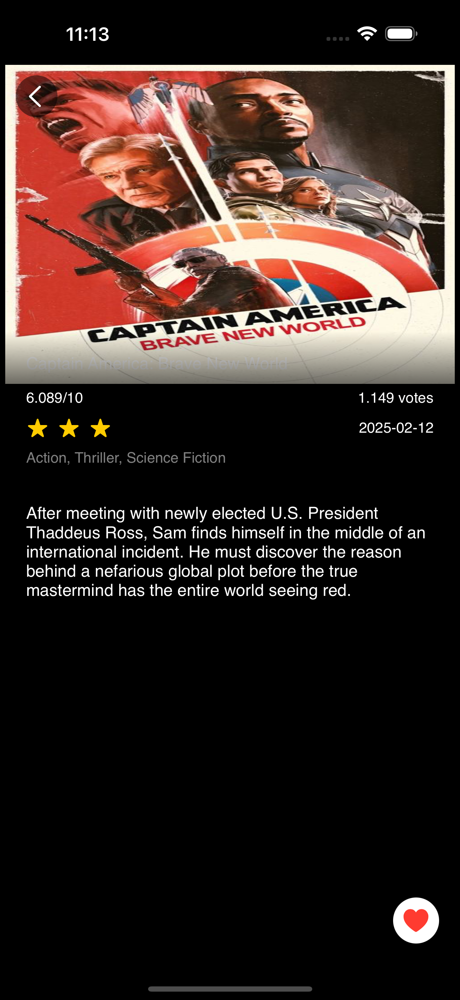

# MovieApp

**MovieApp** is a personal project designed to bring the magic of cinema right to your fingertips. With a sleek, intuitive interface, the app lets you explore a diverse collection of movies across various genres. Whether you’re looking to discover a new blockbuster or revisit an old favorite, MovieApp is crafted to enhance your movie-watching experience.

## Features

- **HomeScreen:**  
  Browse a dynamic selection of films organized by genres such as Romance, Horror, Action, and Suspense. Enjoy a random movie feature that refreshes your experience every time you open the app.

- **DetailScreen:**  
  Dive into detailed information about each movie, including ratings, reviews, release dates, and more. Decide what to watch next with all the details at hand.

- **FavoriteScreen:**  
  Easily mark movies as favorites and keep track of your top picks for quick access.

- **HighlightScreen:**  
  Enjoy a curated showcase of the highest-rated movies, presented in a visually captivating format that celebrates the best in cinema.

## Screenshots

| Home View | Favorite View | Highlight View | Detail View |
|-----------|---------------|----------------|-------------|
|  |  |  |  |


## Technologies Used

- **SwiftUI:** For building a responsive and engaging user interface.
- **MVVM Architecture:** Ensuring a clear separation of concerns and a scalable codebase.
- **Clean Code Principles:** Organized code following best practices for improved maintainability.
- **UserDefaults:** Utilized for persisting data, such as saving favorite movies.
- **AsyncImage & SwiftfulLoadingIndicators:** For asynchronous image loading and smooth, visually appealing loading animations.
- **Custom Networking/API Integration:** (e.g., TheMovieDB API) for fetching up-to-date movie data.

## Getting Started

To run MovieApp locally:

1. **Clone the repository:**

    
```bash
git clone https://github.com/AllanAviana/MovieApp-iOS.git
```


2. **Open the project in Xcode.**

3. **Build and run** on your simulator or device.
